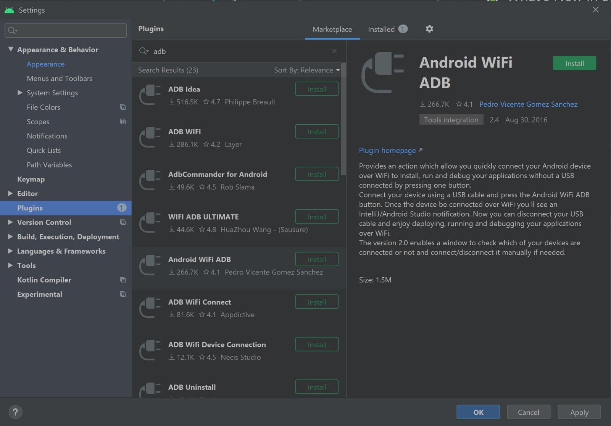

<h2>MyFiestApp</h2>
Practicing android application with kotlin.

<h3>Technolgy & tools Used</h3>
	<ul>
		<li>Android Studio 3.6.2</li>
		<li>Android SDK 29(Android 10.0)</li>
		<li>Java JDK 1.8</li>
  		<li>Kotlin version 1.3.61</li>
		<li>Gradle 5.6.4</li>
	</ul>
	
<h3>Simple Trick- Connect device to InteliJ/AndroidStudio over Wi-Fi</h3>
  <h4>1. Enable USB debugging in phone: </h4>
  <pre>
    <code>
      1. Settings-> About phone-> Tap 7 times over “Build number”->This will activate the developer option
      2. Settings-> System-> Developer options-> Enable USB debugging
    </code>
  </pre>
  <h4>2. Install ADB(Android debug bridge) plugin in InteliJ/AndroidStudio: </h4>
    <pre>
    <code>
	1. For AndroidStudio: Settings-> plugins-> search adb -> install adb developed by Pedro
	2. Connect device using USB cable
	3. Press Android WiFi ADB button
	4. A notification will be popout once the device is connected over WiFi
	5. Now USB cable can be disconnected and application can be debugged over WiFi
    </code>
  </pre>
  
  <h4>References: </h4>
  <ul>
	<li>https://github.com/pedrovgs/AndroidWiFiADB</li>
	<li>https://plugins.jetbrains.com/plugin/7983-android-wifi-adb</li>
  </ul>

